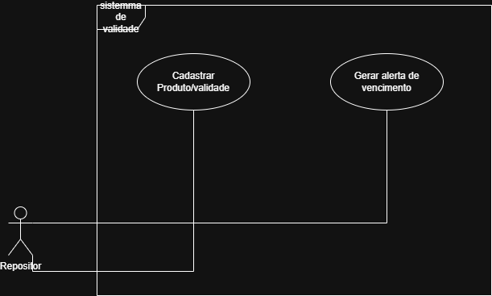

Um sistema que monitora produtos e gera alertas baseados em margens de segurança (ex: 7, 15 ou 30 dias antes do vencimento)
# Gestão de Validade de Estoque

## 📌 Sobre o Projeto
Este sistema foi idealizado para resolver o problema real de perdas de produtos por vencimento em supermercados e comércios de alimentos. O objetivo é monitorar as datas de validade e gerar alertas automáticos.

## 🚀 Funcionalidades Planejadas
- Cadastro de produtos com data de validade e lote.
- Sistema de alertas:
  - 🔴 **Crítico:** Vence em até 7 dias.
  - 🟡 **Atenção:** Vence em até 15 dias.
  - 🟢 **Seguro:** Vence em mais de 30 dias.
- Relatório de produtos próximos ao vencimento para ações de promoção.

## 🏗️ Engenharia de Software (Estudos)
Como estudante de Engenharia de Software, este projeto foca em:
- Levantamento de Requisitos (Funcionais e Não Funcionais).
- Modelagem UML (Diagramas de Caso de Uso e Classes).
- Boas práticas de versionamento com Git.

## 🛠️ Tecnologias
- Linguagem: [A definir, ex: Python ou Java]
- Documentação: Markdown e Ferramentas UML.

## 📋 Levantamento de Requisitos
1. Requisitos Funcionais (O que o sistema faz)
RF01: O sistema deve permitir o cadastro de produtos (Nome, Código de Barras, Setor).

RF02: O sistema deve registrar a data de validade e o lote de cada item.

RF03: O sistema deve gerar um alerta visual (cores diferentes) para produtos que vencem em 7, 15 e 30 dias.

RF04: O sistema deve permitir a consulta de produtos por setor (ex: Mercearia, Frios, Higiene).

2. Requisitos Não Funcionais (Qualidades do sistema)
RNF01: O sistema deve ser capaz de processar uma base de dados com milhares de itens sem lentidão.

RNF02: A interface deve ser simples e objetiva para facilitar o uso durante a reposição no corredor.

RNF03: O sistema deve garantir que os dados não sejam perdidos caso a conexão caia.

## 📊 Regra de Negócio
Devido ao alto volume de itens, o sistema deve priorizar a exibição dos itens com data de validade mais próxima (Lógica PEPS/FIFO).

